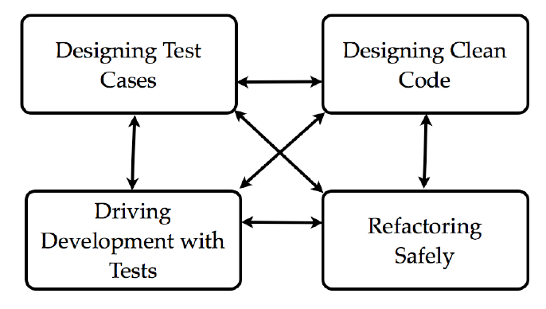
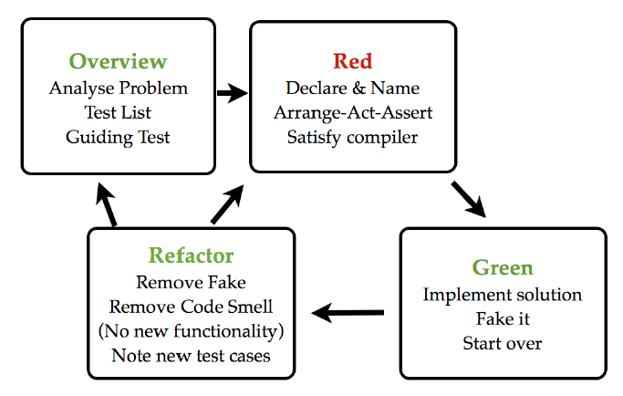

# What you can learn?
pair program  
read other's code  
write clean code  
automated test  
articulate your ideas  
home in particular skills and techniques

# agenda
- Dojo Principles
- Code Kata for TDD
- other styles of TDD
- Functional programming
- what TDD actually is
- how to write good tests

# Dojo Principles
1. One can't discuss a form without code.\n One can't show code without tests.
2. find a master for the form
3. do it, explain share what you learned
4. learn again
5. can't go faster and learn at the same time, so **slow down**
6. Throw yourself in 没看懂
7. 服从master
8. master a subject

# sub-skills of TDD

## Drive Development with tests
gradually build up a piece of code to solve a problem that is too big to solve one goal  
### books
1. Test Driven Development By Example
- break down problems into small pieces  
- identify test cases  
- choose what order to implement them in  
2. Growing Object Oriented Software, Guided By tests  
- The RSpec book work with a Guiding Test in double-loop TDD  

## refactor safely
make a sequence of tiny safe changes that add up to a larger design improvement  
### book
Refactoring: Improving the design of existing code  
- starting code is less than clean  
- improve the design  
- design the test case  

## Design Test Case
being readable, robust, faster
### books
Principles for Agile Automated Test Deisgn  
Three Pillars of Good Tests  
The Art of Unit Tests  
### XUnit Patterns
Mocks, Fakes, Stubs, external dependencies  

## Design Clean code
code is readable
language idiom and styles
### books
1. Agile Software Development Principles, Patterns, Practise  
- Java
- SOLID design Principles
2. Working Effectively with Legacy Code  
- poor -> good  

# TDD的种类
 TDD的种类 | 适用场合  | 方法  | books 
--|---|---|--
 classical TDD |   |   |  
 London School of TDD | OOP  | 1. 类似OOP 2. 使用mock 3. 要求需要两个的Kata  | Growing Object Oriented Software Guided By Test 
 Approval Testing | Legacy Code  | 定义Test Assert部分 -> Code迭代 -> 定义Test  |  
 another style | Functional programming  |   |  

# TDD in terms of States and Moves
  
## Overview State  
1. basic analyze
2. review existing Code
3. identify new functionality
4. write Guiding Test
5. list test cases
6. think about order  
### 说明  
Guiding Test = Coaching Test = Acceptance Tests = Story Test = Scenario = a test for whole User Story  以终为始  

## Red State  

```
                                                  /--- towards GT
a small achieve goal -> choose a test from list <
                                                  \--- address a weekness
```

1. deckeare and name a test(函数_参数_返回值)  
2. [arrange, act, Assert](http://xp123.com/articles/3a-arrange-act-assert/)  
3. satisfy the compiler  

## Green State  
1. pass it **AS SOON AS** possible
2. refactor it

## Refactor State  
1. remove fakes/code smells  
2. imporve readability  
3. NOT add function -- 防止新功能没有UT  
4. Not add test -- note it on lise
5. pass it

## 结束

```
|----------------------------------------|全部步骤
|-----|第一次
retro
|---------------|第二次
retro
|----------------------------------------|第三次
```

# purpose of 自动化测试
1. clarify what to build  
2. detect regression errors
3. document what the system does

# Test设计原则
1. document the 功能
2. provide regression protection
3. cost effective  
4. 可读性
read it through and understand  
- what the test is for
- what the expected behavour is
- what aspects of it are covered  
test fail will  
- quickly see what is broken  
5. robustness  
good test fail will show  
- a regression error --- correct the system
- systeme changed --- update the case  
fragile tests fail will  
- not isolate --- fail in suit
- duplication --- one broken->lot fail
- dependent on random thread/code --- 偶现  
6. speed  
7. 可更新  
which tests are affected by a given change